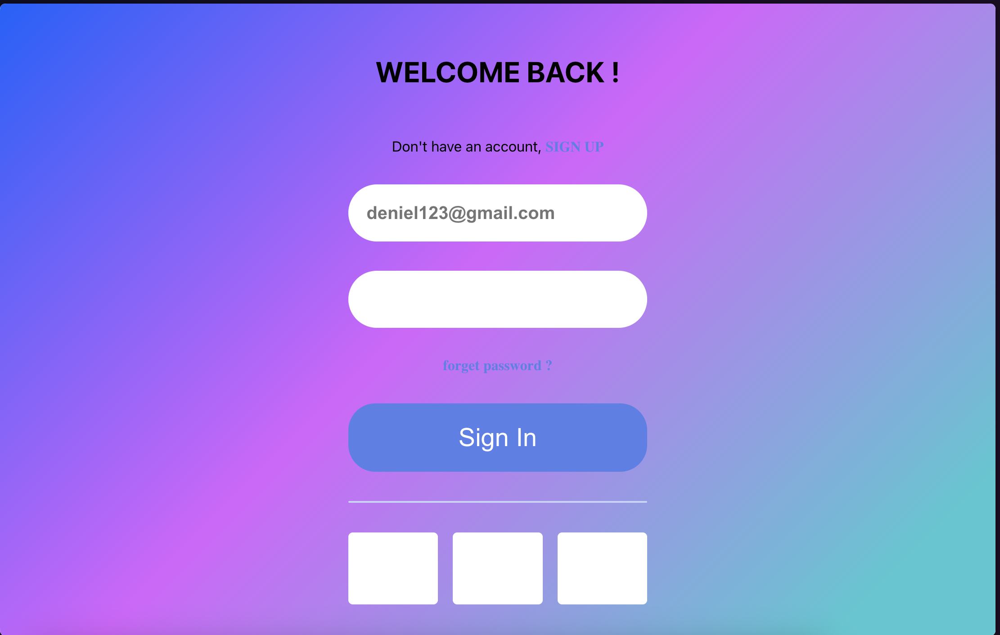
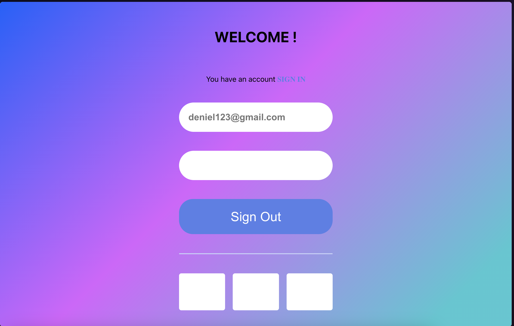
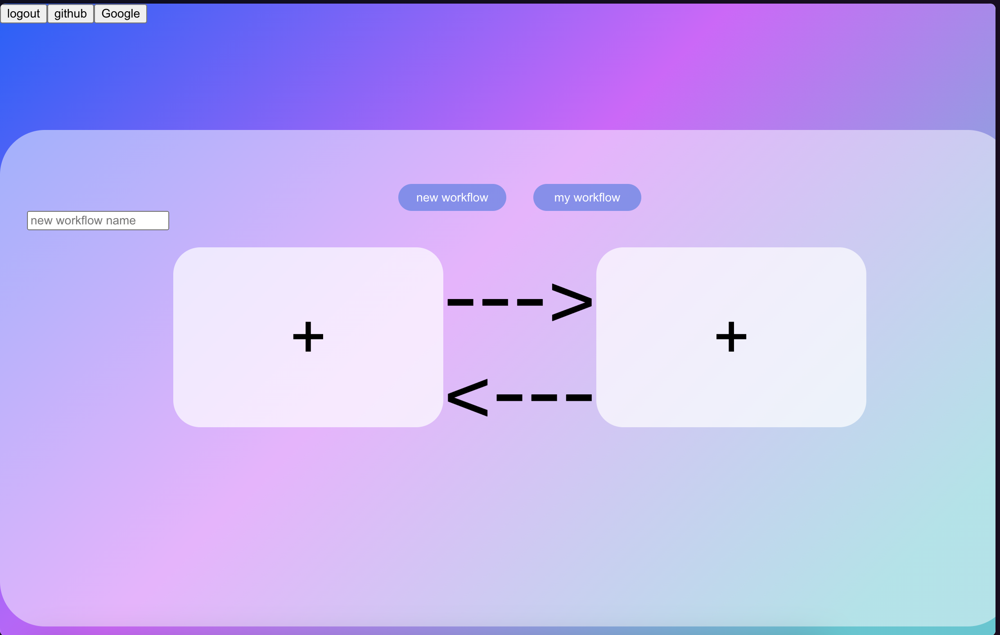

# How to use LeAREA

## What is LeAREA?

LeAREA is a project that aims to create a [IFTTT](https://ifttt.com/) like services.

## How to use it?

To test the project, you can use the docker-compose file in the root of the project : `docker-compose up`.

This docker compose will start 4 containers:
- The MongoDB database
- The Backend API
- The Front web
- The mobile application compilation

### Web interface

To use the web interface, go to [localhost:8081](http://localhost:8081).

#### Home page : Login or register

The home page is the login page. If you don't have an account, you can register by clicking on the register button.

#### Register page

To register, you need to fill the form with your email (as username) and your password.

#### Connect to services

After being logged in, you can connect to services by choosing a new workflow or choosing a registered service into your workflows.

